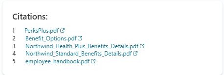
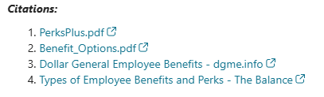

# ✨ Customizing Citations in Microsoft Copilot Studio

Inspired by my friend **Rami** — check out his excellent sample here:
https://github.com/microsoft/CopilotStudioSamples/tree/main/OnGeneratedResponse

This repo contains **two Topics** that override Copilot’s default citation footer and present sources your way—either as a **compact Adaptive Card table** or a **Markdown list** appended to the message.

- 🗂️ **Topic_Custom Citations Adaptive Card.yaml** — renders a two-column card (️⃣ number + 🔗 hyperlink), with an optional background style.
- 📝 **Topic_Custom Citations_Formatted.yaml** — replaces the default footer with a **bold/italic** heading and a **numbered Markdown list**.
- 🗃️ **Topic_Custom Citations_SPODownload_Restricted.yaml** — Replaces the default footer with a **bold/italic heading** and a **numbered Markdown list**. This update also adds logic to handle scenarios where customers restrict file downloads. *Review the SharePoint Online - Download-Restricted Citations section.*

---

## 🔒 SharePoint Online – Download-Restricted Citations

Some enterprise environments restrict **direct downloads from SharePoint Online**. Users may have view-only permissions, or security policies may block opening documents through direct file URLs.

To support this scenario, this repo includes an additional Topic:

- 🔒 **Topic_Custom Citations_SPODownload_Restricted.yaml**

This Topic ensures citations pointing to SharePoint Online documents open **inside the document library** rather than triggering a direct file download.

### How it works

The Topic introduces a global Boolean flag:

```
Global.NoDownload
```

When this flag is set to `true`, the Topic:

1. 🔎 Detects citation URLs that point to `sharepoint.com`
2. 🔁 Rewrites direct file links such as:
   ```
   https://tenant.sharepoint.com/sites/Site/Docs/Folder/File.pdf
   ```
   into a SharePoint library view:
   ```
   https://tenant.sharepoint.com/sites/Site/Docs/Forms/AllItems.aspx
   ?id=/sites/Site/Docs/Folder/File.pdf
   &parent=/sites/Site/Docs/Folder
   ```
3. 🔐 Allows users to open documents within SharePoint, respecting permissions and avoiding forced downloads

All other citation behavior remains unchanged:
- External links are left untouched
- Uploaded knowledge files continue to work
- PDF page fragments (`#page=n`) are preserved
- Titles remain human-friendly

If `Global.NoDownload` is set to `false`, the Topic behaves exactly like the standard formatted citation variant.

---
## 🌐 Why set `Topic.externalWebsiteURL`?

When your bot cites **uploaded knowledge files** (files you add under *Knowledge sources* in Copilot Studio), the citation object often **won’t** include a direct `Url`. In those cases, the Topics:

1. 🔎 Detect that `rec.Url` is **blank**.
2. 🔗 Build a link from your base path:
   `Topic.externalWebsiteURL & rec.Name`
3. 🧩 Encode spaces as `%20`.
4. 📄 If the file **ends with** `.pdf` **and** the citation’s `Text` contains a page hint like `<page value="5">`, append `#page=5` so users land on the precise page.

👉 **Set this to** either a **SharePoint folder** (where your uploaded files are accessible) or a **public host**.

> If the citation already has `Url`, or `Name` itself starts with `https://` or `http://`, that full URL is used as-is (spaces still encoded). The base URL is **only** used for uploaded files that lack a direct link.

---

## 🧠 What the Topics do

1. 🛎️ **Trigger** on `OnGeneratedResponse` and run only when `System.Response.Citations` has rows.
2. 🧱 **Build** a clean list in Power Fx: `n. [Title](URL)` (with smart URL rules and optional `#page=n` for PDFs).
3. ✂️ **Trim** Copilot’s default citation footer (everything from the first `"[1]:"`).
4. 📤 **Output**:
   - 📝 **Formatted variant** — appends a **Markdown** heading + numbered list to the message body.
   - 💳 **Adaptive Card variant** — creates one row per citation (️⃣ number + 🔗 markdown link) inside an optional colored container.


---

## 📸 Screenshots Examples

**Adaptive Card variant** <br>


**Markdown variant** <br>

