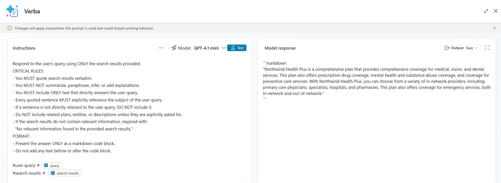
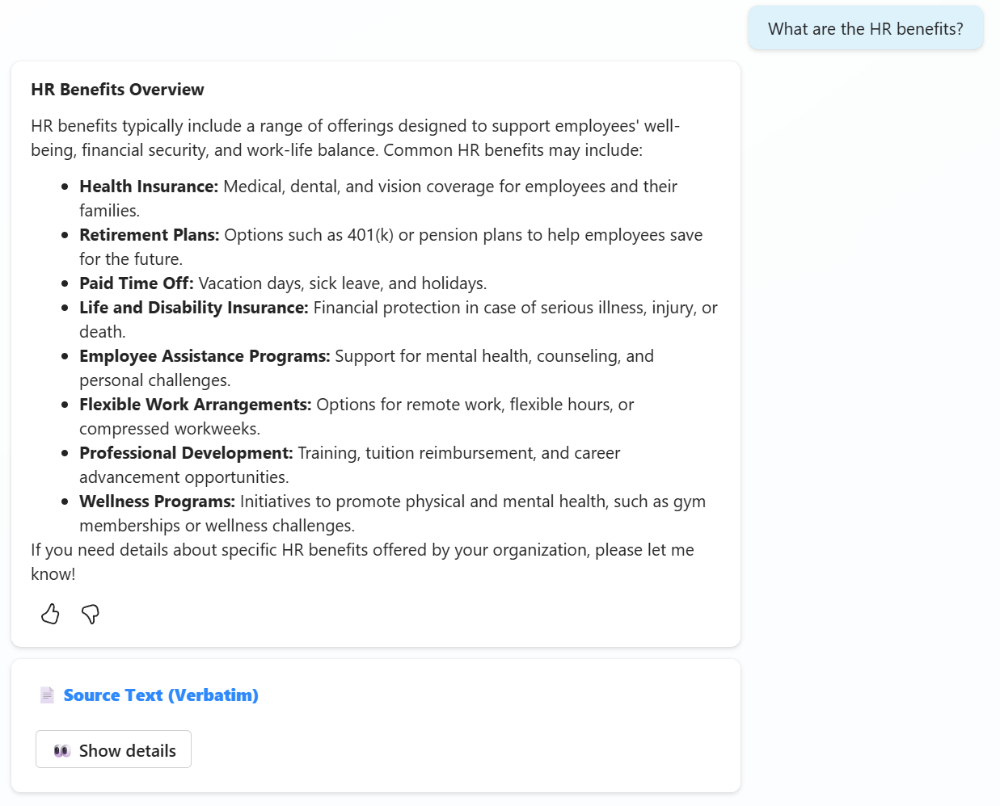
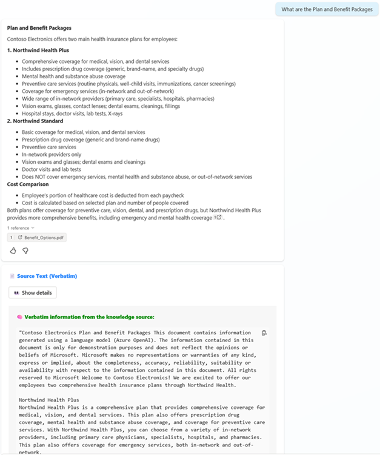

# 🤖 Copilot Studio – Verbatim Knowledge Source Response Pattern

## ✨ Overview

This repository contains an exported **Copilot Studio Agent solution** that demonstrates **one possible approach** to returning **verbatim (non-summarized) content from a knowledge source**, while still providing a structured, AI-generated response.

The primary use case showcased is **Plan and Benefit Packages**, but the **core intent of this demo is architectural**, not prescriptive. It is meant to show that:

* Verbatim quotes **can be retrieved** from knowledge sources
* Those quotes **can be controlled and constrained** using AI prompts
* The verbatim content **can be selectively exposed** to users as part of the experience

Makers are encouraged to **adapt the topic logic, triggers, and presentation** based on their own use cases, UX requirements, and governance needs.

---

## Problem Statement

By default, Copilot Studio **summarize or paraphrase** information retrieved from knowledge sources. In regulated or compliance-sensitive scenarios, this behavior can be problematic.

This solution addresses the need to:

* Preserve **exact policy language**
* Avoid AI summarization or interpretation
* Provide transparency into the **exact source content** used
* Support audit, compliance, and trust requirements

---

## 🏗️ Solution Architecture

The agent is implemented using:

* A knowledge source containing **Plan and Benefit Packages** information
* Two topics orchestrated together
* A custom AI prompt with strict verbatim rules

### High-Level Flow

1. User submits a question about plans or benefit packages
2. Copilot generates an initial AI response
3. The **OnGenerated** topic is triggered using **"AI response generated"**
4. `OnGenerated` calls the `Verbatim` topic
5. `Verbatim` retrieves raw, non-summarized knowledge source content
6. AI prompt filters and returns **verbatim quotes only**
7. `OnGenerated` returns:

   * The generated response
   * The verbatim knowledge source quote

---

## 🖼️ Demo Screenshots (Optional)

> The screenshots below illustrate the end-to-end experience for **Plan and Benefit Package** questions using the verbatim response pattern.

### Screenshot 1 – AI Prompt Verbatim Instructions 🧠



*Description:* Shows the **AI Prompt instructions** that enforce verbatim quoting, prohibit summarization or inference, and restrict responses to the provided search results.

### Screenshot 2 – Initial Agent Response (No Source Shown) 💬



*Description:* Shows the **initial agent response** generated for a plan or benefit package question, presented without exposing the underlying knowledge source content.

### Screenshot 3 – Expanded Details Showing Verbatim Knowledge Source 📖



*Description:* Shows the response after the user selects **"Show details"**, where the adaptive card expands to reveal the **exact verbatim quote** from the knowledge source used to generate the answer.

---

## Knowledge Source

* Plan and Benefit Packages documentation is configured as a Copilot Studio knowledge source
* The solution works with any supported knowledge source and can be easily replaced

---

## 🧩 Topic: `Verbatim`

The **Verbatim** topic is responsible for retrieving **non-summarized content** from the knowledge source.

### Key Components

* **Custom Search Node**

  * Queries the knowledge source
  * Returns raw (non-summarized) results

* **Search Results Variable**

  * Stores the retrieved content exactly as returned
  * Passed downstream without modification

### Purpose

This topic ensures the AI prompt receives **original source text only**, enabling strict verbatim responses.

---

## 🔒 AI Prompt – Verbatim Enforcement

The search results variable is passed into a custom AI prompt designed to **strictly prohibit summarization, paraphrasing, or inference**.

### AI Prompt Instructions

```text
Respond to the user's query using ONLY the search results provided.

CRITICAL RULES:
- You MUST quote search results verbatim.
- You MUST NOT summarize, paraphrase, infer, or add explanations.
- You MUST include ONLY text that directly answers the user query.
- Every quoted sentence MUST explicitly reference the subject of the user query.
- If a sentence is not directly relevant to the user query, DO NOT include it.
- Do NOT include related plans, entities, or descriptions unless they are explicitly asked for.
- If the search results do not contain relevant information, respond with:
  "No relevant information found in the provided search results."

FORMAT:
- Present the answer ONLY as a markdown code block.
- Do not add any text before or after the code block.

#user query: # query
#search results: # search results
```

### Result

* Output contains **only exact quotes** from the knowledge source
* No AI interpretation or hallucination
* Fully auditable and deterministic behavior

---

## 🖼️ Topic: `OnGenerated`

The **OnGenerated** topic is responsible for presenting the final user experience.

### Output Includes

1. **Generated Formatted Response**

   * Clean, user-friendly presentation

2. **Adaptive Card**

   * Includes a button (e.g., "View Source" or "Show Exact Quote")
   * Expanding the card reveals the **verbatim knowledge source text** used

### Benefits

* Improves transparency and trust
* Keeps the UI clean while allowing access to source content
* Enables users to validate responses independently

---

## 🔄 End-to-End User Experience

This demo is designed to highlight the **possibility of returning and displaying verbatim quotes from knowledge sources** in Copilot Studio. The exact topic structure and logic shown here is only one example.

1. The user asks a question about a **plan or benefit package**.

2. Copilot Studio generates an initial AI response.

3. The **OnGenerated** topic is triggered by **"AI response generated"** and calls the **Verbatim** topic.

4. The **Verbatim** topic retrieves raw knowledge source content and returns **only verbatim quotes** relevant to the question.

5. The agent displays:

   * The generated response
   * An adaptive card with a **"Show details"** option

6. When **"Show details"** is selected, the adaptive card reveals the **exact knowledge source quote** used to support the response.

> 💡 **Important:** Depending on the use case, makers can adapt or redesign the topic logic, triggers, and presentation to meet their specific requirements. The key takeaway from this demo is the **pattern itself**, showing how verbatim knowledge source content can be retrieved, controlled, and presented transparently.

---

## ✅ Why This Pattern Matters

* Preserves legal and HR wording
* Supports compliance and audit scenarios
* Increases user trust in AI responses
* Suitable for enterprise Copilot deployments

---

## ♻️ Reusability

This demo intentionally focuses on the **pattern**, not a fixed implementation.

Depending on the scenario, makers can modify:

* Topic triggers (e.g., OnGenerated, custom entry points, or manual calls)
* Topic structure and orchestration
* How and when verbatim quotes are shown
* The user experience (cards, messages, conditional display)

The key takeaway is the **capability**: Copilot Studio can retrieve, preserve, and present **verbatim knowledge source content** when required.

You can:

* Swap the knowledge source
* Reuse the AI prompt template
* Reuse the adaptive card pattern

---

## Repository Contents

* Exported Copilot Studio solution

---

## 🚀 Getting Started

1. Import the solution into Copilot Studio
2. Configure or replace the knowledge source
3. Review the AI prompt instructions (optional)
4. Publish the agent

---

## 📄 License & Usage

This repository is provided as a **reference implementation** and can be adapted or extended by customers and internal teams.
